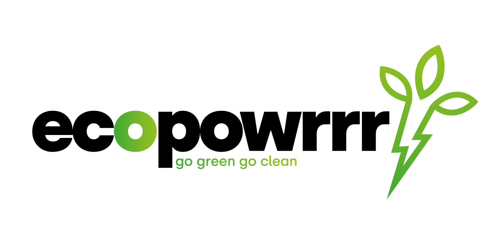

# Ecopowrrr

ecopowrrr is een energieleverancier die 100% sustainable en renewable energie aanbiedt. 
Dit doen ze door het overschot dat huishoudens met  zonnepanelen opwekken in te kopen en vervolgens te verkopen aan hun klanten.
De applicatie leest informatie uit bij de klanten via hun slimme meter, welke hier via een generieke API nagebootst word. Deze informatie wordt vervolgens lokaal opgeslagen en kan in de vorm van spreadsheets opgehaald worden. Alle functionaliteiten zijn via de commands beschikbaar gemaakt.

## Technologieën

Dit project is puur een back-end applicatie. De API is geschreven in nodeJS en haalt zijn data uit MongoDB en de back-end is geschreven in PHP in het Symfony framework.

* PHP
* Symfony
* MySQL / MongoDB, SQLServer
* Restful API (POST/GET/PUT/DELETE)

